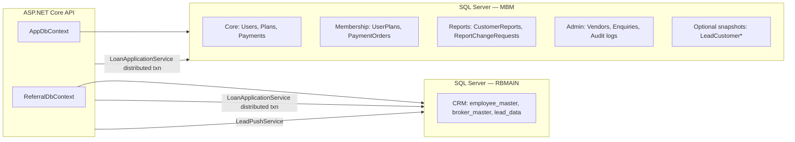
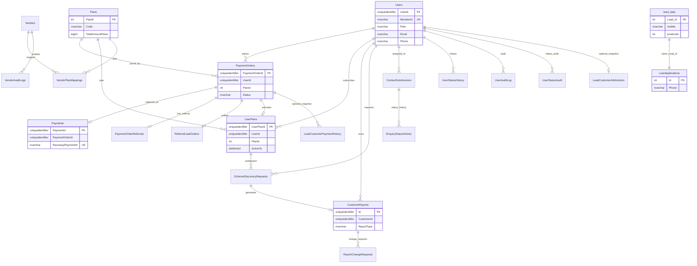
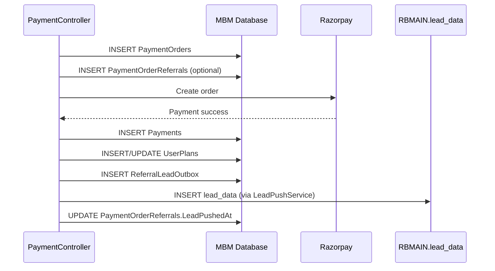
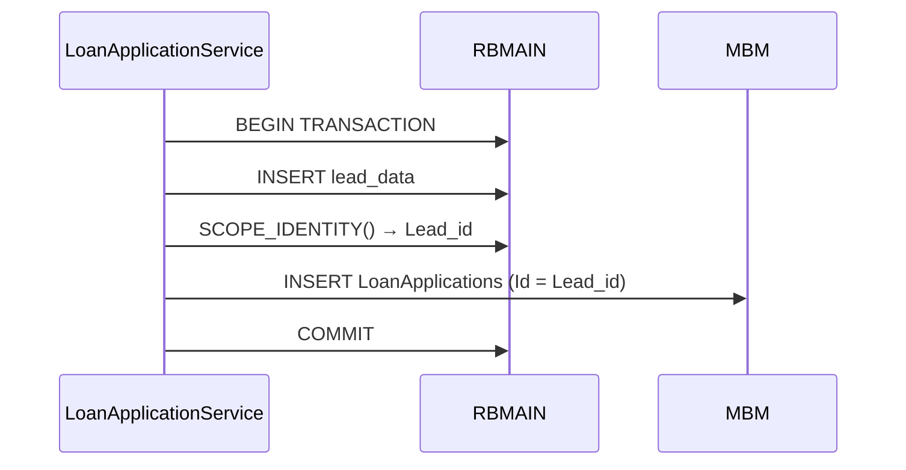

# MSME Bharat Manch (MBM) — Database Architecture Documentation

**Document version:** 1.0  
**Last updated:** June 2026  
**Scope:** Database-related source files only (EF models, DbContexts, schema bootstraps, SQL scripts)  
**Method:** Read-only static analysis — no database or code modifications

---

## Table of Contents

1. [Executive Summary](#executive-summary)
2. [Database Inventory](#database-inventory)
3. [Database Architecture](#database-architecture)
4. [Schema Management Strategy](#schema-management-strategy)
5. [Indexes](#indexes)
6. [Foreign Keys & Constraints](#foreign-keys--constraints)
7. [Views, Functions, Triggers, Stored Procedures](#views-functions-triggers-stored-procedures)
8. [Table Catalog — MBM Database](#table-catalog--mbm-database)
9. [Table Catalog — RBMAIN Database](#table-catalog--rbmain-database)
10. [Entity Relationship Diagram](#entity-relationship-diagram)
11. [Data Flow Documentation](#data-flow-documentation)
12. [Application Usage Matrix](#application-usage-matrix)
13. [Gaps & Assumptions](#gaps--assumptions)

---

## Executive Summary

The MBM application uses **two SQL Server databases** accessed via Entity Framework Core 8:

| Database | Connection Key | Context | Tables Mapped in Code |
|---|---|---|---|
| **MBM** | `ConnectionStrings:ConnectionString` | `AppDbContext` | 25 tables |
| **RBMAIN** | `ConnectionStrings:ReferralDb` | `ReferralDbContext` | 3 tables |

Schema evolution is **not managed through EF migrations** (`Data/Migrations/` is empty). Instead:

- **Startup hosted services** run idempotent `CREATE TABLE` / `ALTER TABLE` / `CREATE INDEX` scripts
- **Manual SQL scripts** in `backend/docs/sql/` document optional or admin-managed schema
- **Legacy core tables** (`Users`, `Plans`, `PaymentOrders`, etc.) pre-exist; only column additions are scripted

No **views**, **stored procedures**, or **user-defined functions** are defined in the repository. One **trigger** on `RBMAIN.dbo.lead_data` is referenced but not defined in source.

---

## Database Inventory

### MBM Database — All Tables

| # | Table | Origin | EF Model | Bootstrap / SQL Script |
|---|---|---|---|---|
| 1 | `Users` | Legacy | Yes | Column/index via `MemberIdSchemaHostedService` |
| 2 | `Plans` | Legacy | Yes | Seed via `SchemeDiscoveryBootstrapHostedService` |
| 3 | `PaymentOrders` | Legacy | Yes | DateTime defaults only |
| 4 | `Payments` | Legacy | Yes | Unique index via `UserPlanSchemaHostedService` |
| 5 | `UserPlans` | Legacy | Yes | Column alters via `UserPlanSchemaHostedService` |
| 6 | `UserStatusAudit` | Legacy | Yes | DateTime defaults only |
| 7 | `UserStatusHistory` | Legacy | Yes | — |
| 8 | `UserAuditLog` | Legacy | Yes | — |
| 9 | `OtpVerifications` | Legacy (unused) | No | DateTime defaults only |
| 10 | `MemberIdSequences` | Bootstrap | Yes | `MemberIdSchemaHostedService` |
| 11 | `PaymentOrderReferrals` | Bootstrap | Yes | `ReferralSchemaHostedService` |
| 12 | `ReferralLeadOutbox` | Bootstrap | Yes | `ReferralSchemaHostedService` |
| 13 | `CustomerReports` | Bootstrap | Yes | `CustomerReportSchemaHostedService` |
| 14 | `ReportAuditLogs` | Bootstrap | Yes | `CustomerReportSchemaHostedService` |
| 15 | `ReportChangeRequests` | Legacy | Yes | — |
| 16 | `ApiExceptionLogs` | Bootstrap | Yes | `ApiExceptionLogSchemaHostedService` |
| 17 | `LoanApplications` | Bootstrap | Yes | `LoanApplicationSchemaBootstrap` |
| 18 | `ContactSubmissions` | Bootstrap | Yes | `ContactSchemaBootstrap` + `enquiry_management_schema.sql` |
| 19 | `EnquiryStatusHistory` | Manual SQL | Yes | `enquiry_management_schema.sql` |
| 20 | `SchemeDiscoveryRequests` | Bootstrap | Yes | `SchemeDiscoveryBootstrapHostedService` |
| 21 | `Vendors` | Manual SQL | Yes | `vendor_management_schema.sql` |
| 22 | `VendorPlanMappings` | Manual SQL | Yes | `vendor_management_schema.sql` |
| 23 | `VendorAuditLogs` | Manual SQL | Yes | `vendor_management_schema.sql` |
| 24 | `LeadCustomerAttributions` | Optional SQL | No | `lead_attribution_schema.sql` (reference only) |
| 25 | `LeadCustomerPaymentHistory` | Optional SQL | No | `lead_attribution_schema.sql` (reference only) |
| 26 | `LeadSourceEvents` | Optional SQL | No | `lead_attribution_schema.sql` (reference only) |

### RBMAIN Database — All Tables

| # | Table | Origin | EF Model | Notes |
|---|---|---|---|---|
| 1 | `employee_master` | Legacy (external CRM) | Yes (`EmployeeMaster`) | Employee referral validation |
| 2 | `broker_master` | Legacy (external CRM) | Yes (`BrokerMaster`) | RBA/PAN referral validation |
| 3 | `lead_data` | Legacy (external CRM) | Yes (`LeadData`) | Has **triggers**; EF disables OUTPUT clause on INSERT |

---

## Database Architecture



### Design Characteristics

| Characteristic | Description |
|---|---|
| **Dual-database** | MBM holds application state; RBMAIN holds CRM lead/referral master data |
| **Logical FKs** | Most relationships are enforced in application code, not declared as SQL FK constraints |
| **Outbox pattern** | `ReferralLeadOutbox` decouples payment activation from lead push to RBMAIN |
| **Audit trails** | Separate audit tables for users, vendors, reports, enquiries, API exceptions |
| **Id mapping** | `LoanApplications.Id` = `lead_data.Lead_id` (cross-database correlation) |
| **OTP storage** | In-memory (`InMemoryOtpService`); `OtpVerifications` table is legacy reference only |

---

## Schema Management Strategy

| Mechanism | Location | Purpose |
|---|---|---|
| `IHostedService` bootstraps | `backend/Auth/*SchemaHostedService.cs` | Auto-create/alter tables at API startup |
| Static bootstraps | `ContactSchemaBootstrap`, `LoanApplicationSchemaBootstrap` | On-demand ensure before first use |
| Manual SQL | `backend/docs/sql/*.sql` | Vendor, enquiry, optional lead attribution |
| EF Core `OnModelCreating` | `AppDbContext.cs` | Column lengths, table names for 3 entities |
| Data annotations | `backend/Models/*.cs` | Table/column mapping for all entities |

**No EF migrations** are checked into the repository.

---

## Indexes

### MBM — Documented Indexes

| Index Name | Table | Columns | Type | Source |
|---|---|---|---|---|
| `UX_Users_MemberId` | `Users` | `MemberId` | Unique filtered (`WHERE MemberId IS NOT NULL`) | `MemberIdSchemaHostedService` |
| `UX_Payments_RazorpayPaymentId` | `Payments` | `RazorpayPaymentId` | Unique | `UserPlanSchemaHostedService` |
| `IX_ReferralLeadOutbox_Status_NextAttempt` | `ReferralLeadOutbox` | `Status`, `NextAttemptAt` | Non-clustered | `ReferralSchemaHostedService` |
| `UX_ReferralLeadOutbox_PaymentOrderId` | `ReferralLeadOutbox` | `PaymentOrderId` | Unique | `ReferralSchemaHostedService` |
| `IX_CustomerReports_CustomerId_UploadDate` | `CustomerReports` | `CustomerId`, `UploadDate DESC` | Non-clustered | `CustomerReportSchemaHostedService` |
| `IX_CustomerReports_SdrLookup` | `CustomerReports` | `CustomerId`, `ReportType`, `IsActive`, `ExpiryDate DESC` | Non-clustered | `CustomerReportSchemaHostedService` |
| `IX_ReportAuditLogs_CreatedAt` | `ReportAuditLogs` | `CreatedAt DESC` | Non-clustered | `CustomerReportSchemaHostedService` |
| `IX_ContactSubmissions_CreatedAt` | `ContactSubmissions` | `CreatedAt DESC` | Non-clustered | `ContactSchemaBootstrap` |
| `IX_ContactSubmissions_Status_CreatedAt` | `ContactSubmissions` | `Status`, `CreatedAt DESC` | Non-clustered | `enquiry_management_schema.sql` |
| `IX_ContactSubmissions_Source` | `ContactSubmissions` | `Source` | Non-clustered | `enquiry_management_schema.sql` |
| `IX_LoanApplications_CreatedAt` | `LoanApplications` | `CreatedAt DESC` | Non-clustered | `LoanApplicationSchemaBootstrap` |
| `IX_Vendors_IsDeleted_IsActive` | `Vendors` | `IsDeleted`, `IsActive` | Non-clustered | `vendor_management_schema.sql` |
| `IX_Vendors_ServiceName` | `Vendors` | `ServiceName` | Non-clustered | `vendor_management_schema.sql` |
| `IX_Vendors_CompanyName` | `Vendors` | `CompanyName` | Non-clustered | `vendor_management_schema.sql` |
| `IX_VendorPlanMappings_PlanId` | `VendorPlanMappings` | `PlanId` | Non-clustered | `vendor_management_schema.sql` |
| `IX_VendorAuditLogs_VendorId_PerformedOn` | `VendorAuditLogs` | `VendorId`, `PerformedOn DESC` | Non-clustered | `vendor_management_schema.sql` |
| `IX_EnquiryStatusHistory_ContactSubmissionId_ChangedOn` | `EnquiryStatusHistory` | `ContactSubmissionId`, `ChangedOn DESC` | Non-clustered | `enquiry_management_schema.sql` |
| `IX_LeadCustomerAttributions_SourceType` | `LeadCustomerAttributions` | `SourceType` | Non-clustered | `lead_attribution_schema.sql` |
| `IX_LeadCustomerAttributions_SourceCode` | `LeadCustomerAttributions` | `SourceCode` | Non-clustered | `lead_attribution_schema.sql` |
| `IX_LeadCustomerAttributions_MemberId` | `LeadCustomerAttributions` | `MemberId` | Non-clustered | `lead_attribution_schema.sql` |
| `IX_LeadCustomerAttributions_AssignedEmployeeId` | `LeadCustomerAttributions` | `AssignedEmployeeId` | Non-clustered | `lead_attribution_schema.sql` |
| `IX_LeadCustomerAttributions_AssignedPartnerId` | `LeadCustomerAttributions` | `AssignedPartnerId` | Non-clustered | `lead_attribution_schema.sql` |
| `IX_LeadCustomerPaymentHistory_UserId_PaidAt` | `LeadCustomerPaymentHistory` | `UserId`, `PaidAt DESC` | Non-clustered | `lead_attribution_schema.sql` |
| `IX_LeadCustomerPaymentHistory_OrderType` | `LeadCustomerPaymentHistory` | `OrderType` | Non-clustered | `lead_attribution_schema.sql` |
| `IX_LeadSourceEvents_UserId_CreatedAt` | `LeadSourceEvents` | `UserId`, `CreatedAt DESC` | Non-clustered | `lead_attribution_schema.sql` |
| `IX_LeadSourceEvents_SourceType` | `LeadSourceEvents` | `SourceType` | Non-clustered | `lead_attribution_schema.sql` |

### Primary Keys

All tables use a single-column primary key (clustered by SQL Server default) unless noted:

| Table | Primary Key Column | Type |
|---|---|---|
| `Users` | `UserId` | `uniqueidentifier` |
| `Plans` | `PlanId` | `int` (identity assumed) |
| `PaymentOrders` | `PaymentOrderId` | `uniqueidentifier` |
| `Payments` | `PaymentId` | `uniqueidentifier` |
| `UserPlans` | `UserPlanId` | `uniqueidentifier` |
| `UserStatusAudit` | `AuditId` | `uniqueidentifier` |
| `UserStatusHistory` | `Id` | `uniqueidentifier` |
| `UserAuditLog` | `Id` | `uniqueidentifier` |
| `MemberIdSequences` | `Year` | `int` |
| `PaymentOrderReferrals` | `PaymentOrderId` | `uniqueidentifier` |
| `ReferralLeadOutbox` | `ReferralLeadOutboxId` | `uniqueidentifier` |
| `CustomerReports` | `Id` | `uniqueidentifier` |
| `ReportAuditLogs` | `AuditId` | `uniqueidentifier` |
| `ReportChangeRequests` | `Id` | `uniqueidentifier` |
| `ApiExceptionLogs` | `LogId` | `uniqueidentifier` |
| `LoanApplications` | `Id` | `int` (not identity; mirrors `lead_data.Lead_id`) |
| `ContactSubmissions` | `Id` | `int IDENTITY` |
| `EnquiryStatusHistory` | `Id` | `uniqueidentifier` |
| `SchemeDiscoveryRequests` | `Id` | `uniqueidentifier` |
| `Vendors` | `VendorId` | `uniqueidentifier` |
| `VendorPlanMappings` | `Id` | `uniqueidentifier` |
| `VendorAuditLogs` | `Id` | `uniqueidentifier` |
| `LeadCustomerAttributions` | `UserId` | `uniqueidentifier` |
| `LeadCustomerPaymentHistory` | `Id` | `uniqueidentifier` |
| `LeadSourceEvents` | `Id` | `uniqueidentifier` |
| `employee_master` | `EmpId` | `int` |
| `broker_master` | `Broker_id` | `int` |
| `lead_data` | `Lead_id` | `int IDENTITY` |

---

## Foreign Keys & Constraints

### Declared SQL Foreign Keys (in repository scripts only)

| Constraint | Child Table.Column | Parent Table.Column |
|---|---|---|
| `FK_VendorPlanMappings_Vendors` | `VendorPlanMappings.VendorId` | `Vendors.VendorId` |
| `FK_VendorPlanMappings_Plans` | `VendorPlanMappings.PlanId` | `Plans.PlanId` |
| `FK_VendorAuditLogs_Vendors` | `VendorAuditLogs.VendorId` | `Vendors.VendorId` |
| `FK_EnquiryStatusHistory_ContactSubmissions` | `EnquiryStatusHistory.ContactSubmissionId` | `ContactSubmissions.Id` |
| `FK_LeadCustomerAttributions_Users` | `LeadCustomerAttributions.UserId` | `Users.UserId` |
| `FK_LeadCustomerPaymentHistory_Users` | `LeadCustomerPaymentHistory.UserId` | `Users.UserId` |
| `FK_LeadCustomerPaymentHistory_PaymentOrders` | `LeadCustomerPaymentHistory.PaymentOrderId` | `PaymentOrders.PaymentOrderId` |
| `FK_LeadSourceEvents_Users` | `LeadSourceEvents.UserId` | `Users.UserId` |

### Unique Constraints

| Constraint | Table | Columns |
|---|---|---|
| `UQ_VendorPlanMappings_Vendor_Plan` | `VendorPlanMappings` | `VendorId`, `PlanId` |
| `UX_Users_MemberId` | `Users` | `MemberId` (filtered unique) |
| `UX_Payments_RazorpayPaymentId` | `Payments` | `RazorpayPaymentId` |
| `UX_ReferralLeadOutbox_PaymentOrderId` | `ReferralLeadOutbox` | `PaymentOrderId` |

### Default Constraints (documented)

| Constraint | Table.Column | Default |
|---|---|---|
| `DF_MemberIdSequences_LastNumber` | `MemberIdSequences.LastNumber` | `0` |
| `DF_CustomerReports_IsActive` | `CustomerReports.IsActive` | `1` |
| `DF_CustomerReports_DownloadCount` | `CustomerReports.DownloadCount` | `0` |
| `DF_CustomerReports_ReportType` | `CustomerReports.ReportType` | `'General'` |
| `DF_UserPlans_CancelAtPeriodEnd` | `UserPlans.CancelAtPeriodEnd` | `0` |
| `DF_UserPlans_AutoRenew` | `UserPlans.AutoRenewEnabled` | `0` |
| `DF_Vendors_IsActive` | `Vendors.IsActive` | `1` |
| `DF_Vendors_IsDeleted` | `Vendors.IsDeleted` | `0` |
| `DF_Vendors_CreatedAt` / `UpdatedAt` | `Vendors` | `GETDATE()` |
| `DF_VendorPlanMappings_AssignedAt` | `VendorPlanMappings.AssignedAt` | `GETDATE()` |
| `DF_VendorAuditLogs_PerformedOn` | `VendorAuditLogs.PerformedOn` | `GETDATE()` |
| `DF_ContactSubmissions_Source` | `ContactSubmissions.Source` | `'Other Pages'` |
| `DF_ContactSubmissions_Status` | `ContactSubmissions.Status` | `'New'` |
| `DF_EnquiryStatusHistory_ChangedOn` | `EnquiryStatusHistory.ChangedOn` | `GETDATE()` |
| `DF_*` (datetime) | Various legacy tables | Migrated to `GETDATE()` by `DateTimeDefaultsSchemaHostedService` |

### Logical Relationships (application-enforced, no SQL FK in repo)

| Child | Parent | Usage |
|---|---|---|
| `PaymentOrders.UserId` | `Users.UserId` | Order creation, payment flow |
| `PaymentOrders.PlanId` | `Plans.PlanId` | Plan pricing snapshot |
| `Payments.PaymentOrderId` | `PaymentOrders.PaymentOrderId` | Payment capture |
| `UserPlans.UserId` | `Users.UserId` | Active membership |
| `UserPlans.PlanId` | `Plans.PlanId` | Plan reference |
| `UserPlans.PaymentOrderId` | `PaymentOrders.PaymentOrderId` | Activation source |
| `CustomerReports.CustomerId` | `Users.UserId` | Report ownership |
| `CustomerReports.SchemeDiscoveryRequestId` | `SchemeDiscoveryRequests.Id` | SDR linkage |
| `SchemeDiscoveryRequests.UserId` | `Users.UserId` | SDR requester |
| `SchemeDiscoveryRequests.UserPlanId` | `UserPlans.UserPlanId` | Entitlement |
| `SchemeDiscoveryRequests.PaymentId` | `Payments.PaymentId` | One-time purchase |
| `ReportChangeRequests.ReportId` | `CustomerReports.Id` | Change workflow |
| `ReferralLeadOutbox.PaymentOrderId` | `PaymentOrders.PaymentOrderId` | Lead push outbox |
| `Users.CreatedByUserId` | `Users.UserId` | Partner/admin attribution |
| `ContactSubmissions.AssignedToUserId` | `Users.UserId` | Enquiry assignment |
| `LoanApplications.Id` | `lead_data.Lead_id` | Cross-DB correlation |

---

## Views, Functions, Triggers, Stored Procedures

| Object Type | Count in Repository | Details |
|---|---|---|
| **Views** | 0 | None defined in source files |
| **Functions** | 0 | None defined in source files |
| **Stored Procedures** | 0 | None defined or called in source files |
| **Triggers** | 1 (referenced) | `RBMAIN.dbo.lead_data` has triggers; EF uses `UseSqlOutputClause(false)` to comply with SQL Server INSERT restrictions |

> **Note:** Additional database objects may exist in production that were created outside this repository.

---

## Table Catalog — MBM Database

### 1. Users

| Attribute | Value |
|---|---|
| **Purpose** | Central identity store for members, partners, admins, and super-admins |
| **Primary Key** | `UserId` (`uniqueidentifier`) |

| Column | Type | Nullable | Description |
|---|---|---|---|
| `UserId` | `uniqueidentifier` | No | Primary key |
| `MemberId` | `nvarchar(16)` | Yes | Customer-facing code (e.g. MBM260001) |
| `Role` | `nvarchar(40)` | No | `member`, `partner`, `admin`, `superadmin` |
| `FullName` | `nvarchar(160)` | No | Display name |
| `Email` | `nvarchar(508)` | No | Login / contact |
| `Phone` | `nvarchar(10)` | No | Mobile |
| `CompanyName` | `nvarchar(240)` | Yes | Business name |
| `PasswordHash` | `varbinary(256)` | No | Hashed password |
| `PasswordSalt` | `varbinary(64)` | No | Password salt |
| `EmailVerifiedAt` | `datetime2` | Yes | Email verification timestamp |
| `PhoneVerifiedAt` | `datetime2` | Yes | Phone verification timestamp |
| `ConsentAccepted` | `bit` | No | GDPR/consent flag |
| `ConsentAcceptedAt` | `datetime2` | Yes | Consent timestamp |
| `IsActive` | `bit` | No | Account active flag |
| `IsDeleted` | `bit` | No | Soft delete |
| `DeletedAt` | `datetime2` | Yes | Deletion timestamp |
| `DeletedByUserId` | `uniqueidentifier` | Yes | Who deleted |
| `CreatedByUserId` | `uniqueidentifier` | Yes | Referring partner/admin |
| `CreatedAt` | `datetime2` | No | Created timestamp |
| `UpdatedAt` | `datetime2` | No | Last updated |

**Relationships:** Parent to `PaymentOrders`, `UserPlans`, `CustomerReports`, `ContactSubmissions` (assignment), partner hierarchy via `CreatedByUserId`

**Application usage:** `AdminController`, `UserController`, `UserManagementService`, `LeadAttributionRepository`, `MemberIdGeneratorService`, auth/registration flows

---

### 2. Plans

| Attribute | Value |
|---|---|
| **Purpose** | Membership and product plan catalog with GST-inclusive pricing |
| **Primary Key** | `PlanId` (`int`) |

| Column | Type | Nullable | Description |
|---|---|---|---|
| `PlanId` | `int` | No | Primary key |
| `Code` | `nvarchar(40)` | No | Plan code (e.g. `scheme-report-onetime`) |
| `Name` | `nvarchar(120)` | No | Display name |
| `Description` | `nvarchar(500)` | Yes | Plan description |
| `BaseAmountPaise` | `bigint` | No | Pre-GST amount in paise |
| `GstPercent` | `decimal(5,2)` | No | GST rate |
| `GstPaise` | `bigint` | No | GST amount in paise |
| `TotalAmountPaise` | `bigint` | No | Total in paise |
| `Currency` | `nvarchar(3)` | No | Default `INR` |
| `DurationDays` | `int` | No | Membership duration (0 = one-time) |
| `IsActive` | `bit` | No | Available for purchase |
| `CreatedAt` | `datetime2` | No | Created |
| `UpdatedAt` | `datetime2` | No | Updated |

**Relationships:** Referenced by `PaymentOrders`, `UserPlans`, `VendorPlanMappings`

**Application usage:** `PaymentController`, `AdminController`, `SchemeDiscoveryBootstrapHostedService` (seeds one-time SDR plan)

---

### 3. PaymentOrders

| Attribute | Value |
|---|---|
| **Purpose** | Razorpay order lifecycle for membership and report purchases |
| **Primary Key** | `PaymentOrderId` (`uniqueidentifier`) |

| Column | Type | Description |
|---|---|---|
| `PaymentOrderId` | `uniqueidentifier` | PK |
| `UserId` | `uniqueidentifier` | Buyer |
| `PlanId` | `int` | Plan reference |
| `PlanCode` | `nvarchar(40)` | Snapshot of plan code |
| `BaseAmountPaise` | `bigint` | Amount breakdown |
| `GstPaise` | `bigint` | GST |
| `TotalAmountPaise` | `bigint` | Total |
| `Currency` | `nvarchar(3)` | Currency |
| `Provider` | `nvarchar(20)` | Default `Razorpay` |
| `RazorpayOrderId` | `nvarchar(64)` | External order ID |
| `Receipt` | `nvarchar(64)` | Receipt reference |
| `Status` | `nvarchar(20)` | `Created`, `Paid`, etc. |
| `FailureReason` | `nvarchar(500)` | Failure detail |
| `Notes` | `nvarchar(500)` | Internal notes |
| `CreatedAt` | `datetime2` | Created |
| `UpdatedAt` | `datetime2` | Updated |

**Relationships:** → `Users`, `Plans`; ← `Payments`, `PaymentOrderReferrals`, `ReferralLeadOutbox`, `UserPlans`

**Application usage:** `PaymentController`, `PaymentActivationService`, `LeadPushService`, `LeadAttributionRepository`, `MembershipEmailService`

---

### 4. Payments

| Attribute | Value |
|---|---|
| **Purpose** | Captured Razorpay payment records |
| **Primary Key** | `PaymentId` (`uniqueidentifier`) |

| Column | Type | Description |
|---|---|---|
| `PaymentId` | `uniqueidentifier` | PK |
| `PaymentOrderId` | `uniqueidentifier` | Parent order |
| `RazorpayOrderId` | `nvarchar(64)` | Razorpay order |
| `RazorpayPaymentId` | `nvarchar(64)` | Razorpay payment (unique index) |
| `RazorpaySignature` | `nvarchar(256)` | Verification signature |
| `Method` | `nvarchar(40)` | Payment method |
| `AmountPaise` | `bigint` | Paid amount |
| `Currency` | `nvarchar(3)` | Currency |
| `Status` | `nvarchar(20)` | Default `Captured` |
| `RawPayload` | `nvarchar(max)` | Webhook/callback JSON |
| `PaidAt` | `datetime2` | Payment time |
| `CreatedAt` | `datetime2` | Record created |

**Application usage:** `PaymentController`, `AdminController` (revenue reports), `SchemeDiscoveryService`

---

### 5. UserPlans

| Attribute | Value |
|---|---|
| **Purpose** | Active and historical membership subscriptions per user |
| **Primary Key** | `UserPlanId` (`uniqueidentifier`) |

| Column | Type | Description |
|---|---|---|
| `UserPlanId` | `uniqueidentifier` | PK |
| `UserId` | `uniqueidentifier` | Member |
| `PlanId` | `int` | Plan |
| `PlanCode` | `nvarchar(40)` | Snapshot |
| `PaymentOrderId` | `uniqueidentifier` | Activating order |
| `ActiveFrom` | `datetime2` | Start date |
| `ActiveTo` | `datetime2` | End date (null = ongoing) |
| `Status` | `nvarchar(20)` | `Active`, `Expired`, etc. |
| `CancelAtPeriodEnd` | `bit` | Opt-out of renewal |
| `CancelledAt` | `datetime2` | Cancellation time |
| `AutoRenewEnabled` | `bit` | Razorpay auto-renewal |
| `RazorpaySubscriptionId` | `nvarchar(64)` | Subscription ID |
| `RazorpayCustomerId` | `nvarchar(64)` | Razorpay customer |
| `CreatedAt` | `datetime2` | Created |
| `UpdatedAt` | `datetime2` | Updated |

**Application usage:** `PaymentActivationService`, `SubscriptionExpiryHostedService`, `SubscriptionReminderHostedService`, `SchemeDiscoveryService`, `AdminController`

---

### 6. UserStatusAudit

| Attribute | Value |
|---|---|
| **Purpose** | Audit log for admin activate/deactivate actions on users |
| **Primary Key** | `AuditId` |

| Column | Type | Description |
|---|---|---|
| `AuditId` | `uniqueidentifier` | PK |
| `TargetUserId` | `uniqueidentifier` | Affected user |
| `ActorUserId` | `uniqueidentifier` | Admin who acted |
| `NewIsActive` | `bit` | New active state |
| `Reason` | `nvarchar(800)` | Reason text |
| `CreatedAt` | `datetime2` | When |

**Application usage:** `AdminController`, `UserManagementService`

---

### 7. UserStatusHistory

| Attribute | Value |
|---|---|
| **Purpose** | Status transition history for admin user management |
| **Primary Key** | `Id` |

| Column | Type | Description |
|---|---|---|
| `Id` | `uniqueidentifier` | PK |
| `UserId` | `uniqueidentifier` | Subject user |
| `UserType` | `nvarchar(40)` | Role category |
| `ActionType` | `nvarchar(40)` | Action performed |
| `OldStatus` | `nvarchar(20)` | Previous status |
| `NewStatus` | `nvarchar(20)` | New status |
| `Remarks` | `nvarchar(800)` | Notes |
| `PerformedByUserId` | `uniqueidentifier` | Actor |
| `PerformedOn` | `datetime2` | Timestamp |

**Application usage:** `UserManagementRepository`, `UserManagementService`

---

### 8. UserAuditLog

| Attribute | Value |
|---|---|
| **Purpose** | Field-level change audit for user profile updates |
| **Primary Key** | `Id` |

| Column | Type | Description |
|---|---|---|
| `Id` | `uniqueidentifier` | PK |
| `UserId` | `uniqueidentifier` | Subject |
| `UserType` | `nvarchar(40)` | Role |
| `Action` | `nvarchar(40)` | e.g. Update |
| `PerformedByUserId` | `uniqueidentifier` | Actor |
| `PerformedOn` | `datetime2` | When |
| `PreviousValues` | `nvarchar(max)` | JSON snapshot |
| `NewValues` | `nvarchar(max)` | JSON snapshot |
| `Remarks` | `nvarchar(800)` | Notes |

**Application usage:** `UserManagementRepository`

---

### 9. MemberIdSequences

| Attribute | Value |
|---|---|
| **Purpose** | Yearly sequence counter for generating `MemberId` values |
| **Primary Key** | `Year` (`int`) |

| Column | Type | Description |
|---|---|---|
| `Year` | `int` | Calendar year |
| `LastNumber` | `int` | Last issued sequence number |

**Application usage:** `MemberIdGeneratorService`, `MemberIdSequenceRepository`

---

### 10. PaymentOrderReferrals

| Attribute | Value |
|---|---|
| **Purpose** | Stores referral code entered at checkout per payment order |
| **Primary Key** | `PaymentOrderId` |

| Column | Type | Description |
|---|---|---|
| `PaymentOrderId` | `uniqueidentifier` | PK (= order FK) |
| `ReferralCode` | `nvarchar(50)` | Entered code |
| `LeadPushedAt` | `datetime2` | Idempotency marker for lead push |
| `CreatedAt` | `datetime2` | Created |
| `UpdatedAt` | `datetime2` | Updated |

**Application usage:** `PaymentController`, `LeadPushService`, `LeadAttributionRepository`, `ReferralService`

---

### 11. ReferralLeadOutbox

| Attribute | Value |
|---|---|
| **Purpose** | Reliable outbox for async lead push to RBMAIN after payment |
| **Primary Key** | `ReferralLeadOutboxId` |

| Column | Type | Description |
|---|---|---|
| `ReferralLeadOutboxId` | `uniqueidentifier` | PK |
| `PaymentOrderId` | `uniqueidentifier` | Source order (unique) |
| `UserId` | `uniqueidentifier` | Member |
| `PlanCode` | `nvarchar(40)` | Plan purchased |
| `ReferralCode` | `nvarchar(50)` | Referral used |
| `AmountPaise` | `bigint` | Order amount |
| `Status` | `nvarchar(20)` | `Pending`, `Processing`, `Done`, `Failed` |
| `Attempts` | `int` | Retry count |
| `LastError` | `nvarchar(1000)` | Last failure message |
| `CreatedAt` | `datetime2` | Created |
| `UpdatedAt` | `datetime2` | Updated |
| `NextAttemptAt` | `datetime2` | Scheduled retry |

**Application usage:** `LeadPushService`, `ReferralService`

---

### 12. CustomerReports

| Attribute | Value |
|---|---|
| **Purpose** | Metadata for uploaded/generated customer report PDFs |
| **Primary Key** | `Id` |

| Column | Type | Description |
|---|---|---|
| `Id` | `uniqueidentifier` | PK |
| `CustomerId` | `uniqueidentifier` | Owner user |
| `MemberId` | `nvarchar(64)` | Member code snapshot |
| `ReportFileName` | `nvarchar(260)` | Stored filename |
| `OriginalFileName` | `nvarchar(260)` | Upload original name |
| `FilePath` | `nvarchar(500)` | Relative path under wwwroot |
| `FileSize` | `bigint` | Bytes |
| `UploadDate` | `datetime2` | Upload time |
| `UploadedBy` | `uniqueidentifier` | Admin uploader |
| `SubscriptionId` | `uniqueidentifier` | Related subscription |
| `IsActive` | `bit` | Soft visibility |
| `DownloadCount` | `int` | Download counter |
| `LastDownloadDate` | `datetime2` | Last download |
| `ReportType` | `nvarchar(40)` | `General` or SDR type |
| `SchemeDiscoveryRequestId` | `uniqueidentifier` | SDR request link |
| `ExpiryDate` | `datetime2` | Report validity end |

**Application usage:** `CustomerReportService`, `SdrReportService`, `AdminReportsController`, `CustomerReportsController`, `LeadAttributionRepository`

---

### 13. ReportAuditLogs

| Attribute | Value |
|---|---|
| **Purpose** | Audit trail for report uploads, downloads, and changes |
| **Primary Key** | `AuditId` |

| Column | Type | Description |
|---|---|---|
| `AuditId` | `uniqueidentifier` | PK |
| `UserId` | `uniqueidentifier` | Actor (nullable) |
| `Action` | `nvarchar(40)` | Action type |
| `ReportId` | `uniqueidentifier` | Report reference |
| `CustomerId` | `uniqueidentifier` | Customer reference |
| `CreatedAt` | `datetime2` | When |
| `IpAddress` | `nvarchar(64)` | Client IP |
| `RequestId` | `uniqueidentifier` | Correlation ID |
| `Remarks` | `nvarchar(2000)` | Notes |
| `PreviousReportPath` | `nvarchar(500)` | Old file path |
| `NewReportPath` | `nvarchar(500)` | New file path |
| `PreviousValues` | `nvarchar(max)` | JSON before |
| `NewValues` | `nvarchar(max)` | JSON after |

> Bootstrap creates a minimal column set; extended columns exist in the EF model and may require manual migration in older environments.

**Application usage:** `ReportAuditService`, `ReportAuditRepository`, `CustomerReportService`, `ReportChangeRequestService`

---

### 14. ReportChangeRequests

| Attribute | Value |
|---|---|
| **Purpose** | Admin workflow for report edit/replace/delete approval |
| **Primary Key** | `Id` |

| Column | Type | Description |
|---|---|---|
| `Id` | `uniqueidentifier` | PK |
| `ReportId` | `uniqueidentifier` | Target report |
| `RequestType` | `nvarchar(20)` | Edit / Replace / Delete |
| `RequestedBy` | `uniqueidentifier` | Requesting admin |
| `RequestedOn` | `datetime2` | Request time |
| `ApprovedBy` | `uniqueidentifier` | Approver |
| `ApprovedOn` | `datetime2` | Approval time |
| `RejectedBy` | `uniqueidentifier` | Rejector |
| `RejectedOn` | `datetime2` | Rejection time |
| `Reason` | `nvarchar(2000)` | Request reason |
| `Remarks` | `nvarchar(2000)` | Admin remarks |
| `PreviousReportPath` | `nvarchar(500)` | Path before |
| `NewReportPath` | `nvarchar(500)` | Path after |
| `PreviousValues` | `nvarchar(max)` | JSON before |
| `NewValues` | `nvarchar(max)` | JSON after |
| `Status` | `nvarchar(20)` | `Pending`, `Approved`, `Rejected` |
| `PendingFileName` | `nvarchar(260)` | Staged file |
| `PendingOriginalFileName` | `nvarchar(260)` | Staged original |
| `PendingFileSize` | `bigint` | Staged size |

**Application usage:** `ReportChangeRequestService`, `ReportChangeRequestRepository`, `AdminReportsController`

---

### 15. ApiExceptionLogs

| Attribute | Value |
|---|---|
| **Purpose** | Persistent log of unhandled API exceptions |
| **Primary Key** | `LogId` |

| Column | Type | Description |
|---|---|---|
| `LogId` | `uniqueidentifier` | PK |
| `CreatedAt` | `datetime2` | When |
| `HttpMethod` | `nvarchar(16)` | HTTP verb |
| `RequestPath` | `nvarchar(500)` | URL path |
| `StatusCode` | `int` | HTTP status |
| `UserId` | `uniqueidentifier` | Authenticated user |
| `IpAddress` | `nvarchar(64)` | Client IP |
| `OperationKey` | `nvarchar(80)` | Operation identifier |
| `UserMessage` | `nvarchar(500)` | Friendly message |
| `ExceptionType` | `nvarchar(200)` | .NET type |
| `ExceptionMessage` | `nvarchar(max)` | Message |
| `InnerExceptionMessage` | `nvarchar(max)` | Inner exception |
| `StackTrace` | `nvarchar(max)` | Stack trace |

**Application usage:** `ApiExceptionLogService`, `GlobalApiExceptionHandler`

---

### 16. LoanApplications

| Attribute | Value |
|---|---|
| **Purpose** | Local copy of loan enquiries; `Id` mirrors RBMAIN `lead_data.Lead_id` |
| **Primary Key** | `Id` (`int`, not identity) |

| Column | Type | Description |
|---|---|---|
| `Id` | `int` | PK = `lead_data.Lead_id` |
| `FullName` | `nvarchar(160)` | Applicant name |
| `Phone` | `nvarchar(10)` | Mobile |
| `Email` | `nvarchar(508)` | Email |
| `Pincode` | `nvarchar(6)` | Pincode |
| `LoanTypeId` | `int` | Product ID |
| `LoanAmount` | `bigint` | Requested amount |
| `ConsentAccepted` | `bit` | Consent |
| `ConsentAcceptedAt` | `datetime2` | Consent time |
| `CreatedAt` | `datetime2` | Submitted |

**Application usage:** `LoanApplicationService`, `LoansController`

---

### 17. ContactSubmissions

| Attribute | Value |
|---|---|
| **Purpose** | Contact form and enquiry records (also used as enquiry management source) |
| **Primary Key** | `Id` (`int IDENTITY`) |

| Column | Type | Description |
|---|---|---|
| `Id` | `int` | PK (identity) |
| `FullName` | `nvarchar(160)` | Name |
| `Phone` | `nvarchar(10)` | Mobile |
| `Email` | `nvarchar(508)` | Email |
| `SubjectId` | `int` | Subject catalog ID |
| `Message` | `nvarchar(4000)` | Message body |
| `ConsentAccepted` | `bit` | Consent |
| `ConsentAcceptedAt` | `datetime2` | Consent time |
| `CreatedAt` | `datetime2` | Submitted |
| `ConfirmationEmailSentAt` | `datetime2` | Email sent marker |
| `CompanyName` | `nvarchar(200)` | Company (enquiry ext) |
| `Source` | `nvarchar(80)` | Page source |
| `Status` | `nvarchar(20)` | `New`, `Resolved`, `Closed` |
| `AssignedToUserId` | `uniqueidentifier` | Assigned admin |
| `UpdatedAt` | `datetime2` | Last update |

**Application usage:** `ContactService`, `ContactController`, `EnquiryManagementService`, `EnquiryManagementRepository`

---

### 18. EnquiryStatusHistory

| Attribute | Value |
|---|---|
| **Purpose** | Status change audit for contact enquiries |
| **Primary Key** | `Id` |

| Column | Type | Description |
|---|---|---|
| `Id` | `uniqueidentifier` | PK |
| `ContactSubmissionId` | `int` | FK → `ContactSubmissions` |
| `OldStatus` | `nvarchar(20)` | Previous |
| `NewStatus` | `nvarchar(20)` | New status |
| `ChangedByUserId` | `uniqueidentifier` | Admin actor |
| `ChangedOn` | `datetime2` | When |
| `Remarks` | `nvarchar(800)` | Notes |

**Application usage:** `EnquiryManagementRepository`, `EnquiryManagementService`

---

### 19. SchemeDiscoveryRequests

| Attribute | Value |
|---|---|
| **Purpose** | Tracks Scheme Discovery Report (SDR) generation requests via Saarthi API |
| **Primary Key** | `Id` |

| Column | Type | Description |
|---|---|---|
| `Id` | `uniqueidentifier` | PK |
| `UserId` | `uniqueidentifier` | Requester |
| `MemberId` | `nvarchar(64)` | Member code |
| `UserPlanId` | `uniqueidentifier` | Entitlement plan |
| `UdyamNumber` | `nvarchar(32)` | Udyam registration |
| `PaymentId` | `uniqueidentifier` | One-time payment |
| `EntitlementType` | `nvarchar(20)` | Membership vs one-time |
| `Status` | `nvarchar(20)` | Processing state |
| `ExternalReference` | `nvarchar(128)` | Saarthi reference |
| `ErrorMessage` | `nvarchar(1000)` | Failure detail |
| `CustomerReportId` | `uniqueidentifier` | Generated report |
| `RequestedAt` | `datetime2` | Request start |
| `CompletedAt` | `datetime2` | Completion |
| `CreatedAt` | `datetime2` | Created |
| `UpdatedAt` | `datetime2` | Updated |

**Application usage:** `SchemeDiscoveryService`, `SdrReportService`, `SchemeDiscoveryController`

---

### 20–22. Vendors, VendorPlanMappings, VendorAuditLogs

See `vendor_management_schema.sql` for full DDL. Summary:

| Table | Purpose |
|---|---|
| `Vendors` | Service vendor master (company, contact, location, soft delete) |
| `VendorPlanMappings` | Many-to-many: vendors eligible for specific plans |
| `VendorAuditLogs` | Vendor CRUD audit trail |

**Application usage:** `VendorManagementService`, `VendorManagementRepository`, `VendorManagementController`

---

### 23–25. LeadCustomerAttributions, LeadCustomerPaymentHistory, LeadSourceEvents (Optional)

These tables are documented in `lead_attribution_schema.sql` as **optional persistence snapshots**. The lead attribution module computes attribution at runtime from core tables and does **not require** these tables.

**Application usage:** Not mapped in EF; runtime queries use `Users`, `PaymentOrders`, `PaymentOrderReferrals`, `UserPlans`, `CustomerReports`, `Plans`, and RBMAIN masters via `LeadAttributionRepository`

---

### 26. OtpVerifications (Legacy)

Referenced only in `DateTimeDefaultsSchemaHostedService` for datetime default migration. **Not mapped in EF.** Current OTP flow uses `InMemoryOtpService` (no database persistence).

---

## Table Catalog — RBMAIN Database

### 1. employee_master

| Attribute | Value |
|---|---|
| **Purpose** | Employee referral code validation |
| **Primary Key** | `EmpId` (`int`) |

| Column | Type | Description |
|---|---|---|
| `EmpId` | `int` | PK |
| `Emp_Name` | `nvarchar(200)` | Employee name |
| `Emp_Code` | `nvarchar(50)` | Referral code |
| `Is_Active` | `bit` | Active flag |

**Application usage:** `EmployeeValidationService`, `ReferralController`, `LeadPushService`

---

### 2. broker_master

| Attribute | Value |
|---|---|
| **Purpose** | RBA broker validation by PAN number |
| **Primary Key** | `Broker_id` (`int`) |

| Column | Type | Description |
|---|---|---|
| `Broker_id` | `int` | PK |
| `Broker_Name` | `nvarchar(200)` | Broker name |
| `PAN_No` | `nvarchar(20)` | PAN (referral code for RBA) |
| `Emp_Code` | `nvarchar(50)` | Linked employee code |
| `Is_Active` | `int` | 1 = active |

**Application usage:** `EmployeeValidationService`

---

### 3. lead_data

| Attribute | Value |
|---|---|
| **Purpose** | CRM lead records for membership payments and loan applications |
| **Primary Key** | `Lead_id` (`int IDENTITY`) |
| **Triggers** | Present (definition not in repository); EF disables OUTPUT clause |

| Column | Type | Description |
|---|---|---|
| `Lead_id` | `int` | PK (identity) |
| `mobile` | `nvarchar(50)` | Phone |
| `name` | `nvarchar(100)` | Name |
| `email` | `nvarchar(300)` | Email |
| `productid` | `int` | Product/loan type |
| `Pincode` | `nvarchar(10)` | Pincode |
| `profession` | `int` | Employment type |
| `source_id` | `int` | Source ID |
| `lead_source` | `nvarchar(500)` | Source label |
| `lead_type` | `nvarchar(50)` | Lead type |
| `campaignName` | `nvarchar(200)` | Campaign |
| `sysdate` | `datetime` | System date |
| `emp_code` | `nvarchar(20)` | Employee code |
| `broker_id` | `int` | Broker reference |
| `Lead_Status_id` | `int` | CRM status |
| `lead_date` | `datetime` | Lead date |
| `Created_Datetime` | `datetime` | Created |
| `CompanyName` | `nvarchar(550)` | Company |

**Application usage:** `LeadPushService` (membership), `LoanApplicationService` (loans, distributed transaction)

---

## Stored Procedures

**None identified in repository source files.**

The application uses:

- EF Core LINQ queries via repositories
- Raw SQL for schema bootstrapping (`ExecuteSqlRawAsync`)
- `SCOPE_IDENTITY()` query after `lead_data` INSERT in `LoanApplicationService`

---

## Entity Relationship Diagram



---

## Data Flow Documentation

### 1. Member Registration & Authentication

```
Browser → AuthController → InMemoryOtpService (no DB)
        → UserController/AdminController → Users table
        → MemberIdGeneratorService → MemberIdSequences + Users.MemberId
```

### 2. Membership Payment



### 3. Loan Application (Distributed Transaction)



### 4. Scheme Discovery Report

```
SchemeDiscoveryController → SchemeDiscoveryService
  → SchemeDiscoveryRequests (INSERT)
  → Saarthi API (external)
  → CustomerReports (INSERT, ReportType = SDR)
  → ReportAuditLogs (INSERT)
```

### 5. Admin Report Management

```
AdminReportsController → CustomerReportService → CustomerReports
                       → ReportChangeRequestService → ReportChangeRequests
                       → ReportAuditService → ReportAuditLogs
```

### 6. Enquiry Management

```
ContactController → ContactService → ContactSubmissions (INSERT)
EnquiryManagementController → EnquiryManagementService
  → ContactSubmissions (UPDATE status/assignment)
  → EnquiryStatusHistory (INSERT on status change)
```

### 7. Lead Attribution (Runtime)

```
LeadAttributionController → LeadAttributionRepository
  → JOIN Users, PaymentOrders, PaymentOrderReferrals, UserPlans, Plans, CustomerReports
  → ReferralDbContext: employee_master, broker_master (lookup)
  → Optional: LeadCustomerAttributions (if SQL script deployed)
```

---

## Application Usage Matrix

| Table | Repository / Service | Controller(s) |
|---|---|---|
| `Users` | `UserManagementRepository`, `LeadAttributionRepository`, direct in controllers | `AdminController`, `UserController`, `UserManagementController` |
| `Plans` | Multiple services | `AdminController`, `PaymentController` |
| `PaymentOrders` | `PaymentActivationService`, `LeadAttributionRepository` | `PaymentController`, `AdminController` |
| `Payments` | `PaymentActivationService` | `PaymentController`, `AdminController` |
| `UserPlans` | `PaymentActivationService`, subscription hosted services | `UserController`, `AdminController` |
| `PaymentOrderReferrals` | `LeadPushService`, `ReferralService` | `PaymentController`, `ReferralController` |
| `ReferralLeadOutbox` | `LeadPushService` | Internal |
| `CustomerReports` | `CustomerReportRepository` | `AdminReportsController`, `CustomerReportsController` |
| `ReportChangeRequests` | `ReportChangeRequestRepository` | `AdminReportsController` |
| `ReportAuditLogs` | `ReportAuditRepository` | Internal |
| `SchemeDiscoveryRequests` | `SchemeDiscoveryService`, `SdrReportService` | `SchemeDiscoveryController` |
| `LoanApplications` | `LoanApplicationService` | `LoansController` |
| `ContactSubmissions` | `EnquiryManagementRepository`, `ContactService` | `ContactController`, `EnquiryManagementController` |
| `EnquiryStatusHistory` | `EnquiryManagementRepository` | `EnquiryManagementController` |
| `Vendors` / mappings / audit | `VendorManagementRepository` | `VendorManagementController` |
| `ApiExceptionLogs` | `ApiExceptionLogService` | Global middleware |
| `MemberIdSequences` | `MemberIdSequenceRepository` | Registration flow |
| `employee_master` | `EmployeeValidationService` | `ReferralController` |
| `broker_master` | `EmployeeValidationService` | `ReferralController` |
| `lead_data` | `LeadPushService`, `LoanApplicationService` | `LoansController`, payment flow |

---

## Gaps & Assumptions

| Item | Status |
|---|---|
| `Users`, `Plans`, `PaymentOrders`, `Payments`, `UserPlans`, `ReportChangeRequests`, `UserStatusHistory`, `UserAuditLog` DDL | **Not in repository** — assumed pre-existing legacy schema |
| `OtpVerifications` | Legacy table; OTP now in-memory |
| `ReportAuditLogs` extended columns | Bootstrap creates subset; production may have additional columns per EF model |
| `lead_data` triggers | Referenced but trigger body not in repo |
| `LeadCustomer*` tables | Optional; module works without them |
| `Employee_Master` vs `employee_master` | Model annotation says `Employee_Master`; `ReferralDbContext` maps to `employee_master` |
| Production-only DB objects | Views, procedures, or indexes may exist outside this codebase |

---

## Related Files

| File | Role |
|---|---|
| `backend/Data/AppDbContext.cs` | MBM EF context |
| `backend/Data/ReferralDbContext.cs` | RBMAIN EF context |
| `backend/Models/*.cs` | Entity definitions (22 files) |
| `backend/Referrals/Models/*.cs` | RBMAIN entity definitions |
| `backend/Auth/*SchemaHostedService.cs` | Startup schema bootstraps |
| `backend/Auth/ContactSchemaBootstrap.cs` | Contact table ensure |
| `backend/Auth/LoanApplicationSchemaBootstrap.cs` | Loan table ensure |
| `backend/docs/sql/*.sql` | Manual DDL scripts |

---

*End of document*
