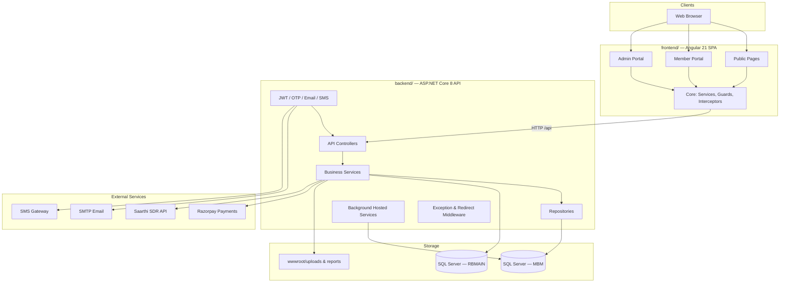
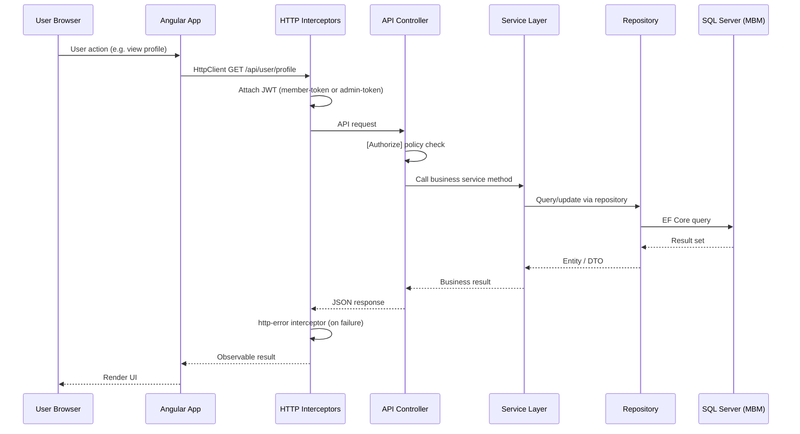
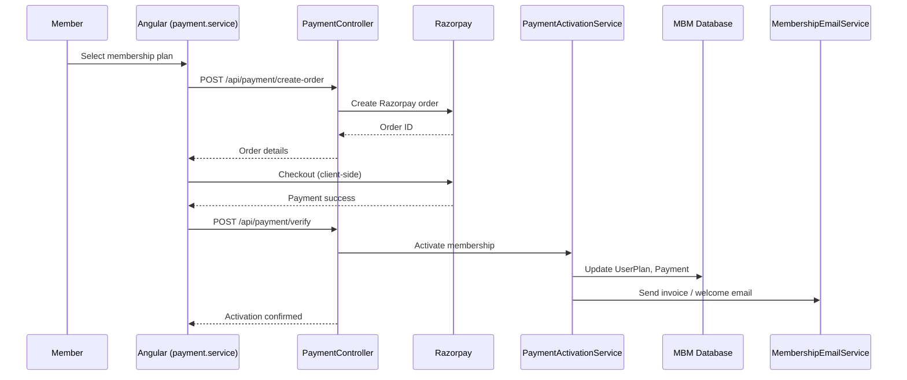

# MSME Bharat Manch (MBM) — Solution Structure Documentation

**Document version:** 1.0  
**Last updated:** June 2026  
**Workspace:** `d:\MBM`

This document describes the complete solution structure, architecture, technology stack, and deployment model for the MSME Bharat Manch platform. It is intended for developers, architects, and operations staff onboarding to the project.

---

## Table of Contents

1. [Project Overview](#project-overview)
2. [Solution Structure](#solution-structure)
3. [Architecture Overview](#architecture-overview)
4. [Folder Structure](#folder-structure)
5. [Technology Stack](#technology-stack)
6. [External Dependencies](#external-dependencies)
7. [Purpose of Each Project / Module](#purpose-of-each-project--module)
8. [High Level Architecture Diagram](#high-level-architecture-diagram)
9. [Request Flow Diagram](#request-flow-diagram)
10. [Deployment Overview](#deployment-overview)

---

## Project Overview

**MSME Bharat Manch (MBM)** is a full-stack web platform for MSME membership, services, scheme discovery, loan applications, payments, and admin operations. The workspace is organized as a **two-application monorepo**:

| Application | Location | Type | Primary Role |
|---|---|---|---|
| **MBM-App** | `frontend/` | Angular 21 SPA | Public website, member portal, admin UI |
| **mbm-api** | `backend/` | ASP.NET Core 8 Web API | REST API, auth, business logic, static hosting |

There is **one Visual Studio solution** (`backend/mbm-api.sln`) containing a **single .NET project**. The Angular app is a separate npm project and is **not referenced in the `.sln` file**.

| Environment | Domain |
|---|---|
| Production | `msmebharatmanch.com` |
| UAT | `uat.rupeeboss.com` |
| Local development | `localhost:4200` (frontend), `localhost:5228` (API) |

---

## Solution Structure

### Identified Projects

| # | Project Name | Path | Technology | Category |
|---|---|---|---|---|
| 1 | **mbm-api** | `backend/mbm-api.csproj` | .NET 8, ASP.NET Core | Backend API |
| 2 | **MBM-App** | `frontend/` (`package.json`: `mbm-app`) | Angular 21, TypeScript | Frontend SPA |

### Project Classification

| Layer | Project / Location | Notes |
|---|---|---|
| **Frontend** | `frontend/` | Angular standalone components, routing, guards, HTTP services |
| **Backend** | `backend/` | Controllers, services, repositories, auth, middleware |
| **Database** | SQL Server (external) | `MBM` (primary), `RBMAIN` (referral/lead) — accessed via EF Core |
| **Shared Libraries** | *None as separate projects* | Shared logic lives inside each app (`frontend/src/app/core/`, `backend/Services/`, etc.) |
| **Utilities / Infrastructure** | Embedded in backend | `Auth/`, `Middleware/`, `Templates/`, `docs/sql/`, hosted background services |

### Project Hierarchy

```
MBM (Workspace Root)
│
├── frontend/                    ← MBM-App (Angular SPA)
│   ├── src/app/
│   │   ├── admin/               ← Admin portal features
│   │   ├── user/                ← Member auth & profile
│   │   ├── pages/               ← Public marketing/content pages
│   │   ├── core/                ← Shared frontend infrastructure
│   │   ├── data/                ← Static content data files
│   │   ├── header/, footer/     ← Layout shell components
│   │   └── offering/            ← Offering-related UI
│   ├── public/                  ← Static assets (images, videos)
│   ├── scripts/                 ← Build-time scripts
│   └── environments/            ← Environment configs (local/uat/prod)
│
└── backend/                     ← mbm-api (.NET 8 Web API)
    ├── mbm-api.sln              ← Visual Studio solution (1 project)
    ├── Controllers/             ← API endpoints (14 controllers)
    ├── Services/                ← Business logic + repository implementations
    │   ├── IRepository/         ← Repository interfaces
    │   └── Repository/          ← Repository implementations
    ├── Data/                    ← EF Core DbContexts
    ├── Models/                  ← Entity models (22 entities)
    ├── DTO/                     ← API request/response DTOs
    ├── Auth/                    ← JWT, OTP, email/SMS, schema bootstraps
    ├── Referrals/               ← Referral DB models & validation
    ├── Middleware/              ← Exception handling, URL redirects
    ├── Templates/               ← HTML email templates
    ├── Assets/                  ← Backend static assets (e.g. invoice logo)
    ├── wwwroot/                 ← Published SPA + uploaded files
    ├── docs/                    ← Setup docs + SQL schema scripts
    └── Properties/              ← Launch & publish profiles
```

---

## Architecture Overview

### Primary Pattern

**N-Tier Layered Architecture + Service Layer + Repository Pattern**

The backend follows a classic layered structure within a single assembly:

```
Presentation  →  Controllers          (HTTP / API)
Business      →  Services             (domain/business logic)
Data Access   →  Repositories        (EF Core queries)
Persistence   →  DbContext / SQL Server
```

### Architecture Patterns Assessment

| Pattern | Present? | Evidence |
|---|---|---|
| **N-Tier / Layered** | Yes | Clear separation: Controllers → Services → Repositories → DbContext |
| **Service Layer** | Yes | `Services/*.cs` with `I*Service` interfaces |
| **Repository Pattern** | Yes | `Services/IRepository/` + `Services/Repository/` |
| **MVC (API variant)** | Partial | `[ApiController]` controllers; no server-side views (SPA handles UI) |
| **SPA + API hosting** | Yes | API serves Angular from `wwwroot` with `MapFallbackToFile` |
| **Clean Architecture** | No | No separate Domain/Application/Infrastructure projects |
| **CQRS** | No | No command/query buses; services handle both reads and writes |
| **Microservices** | No | Monolithic API with dual-database access |

### Frontend Architecture

Angular **feature-based** structure with a shared **`core/`** layer:

- **Pages** — public marketing and content routes
- **User** — member registration, login, profile, plan
- **Admin** — dashboards, reports, user/vendor/enquiry/lead management
- **Core** — services, guards, interceptors, validators, reusable components, utilities

Uses **standalone components**, **route guards** (`authGuard`, `adminGuard`), and **HTTP interceptors** for JWT tokens and error handling.

### Database Strategy

| Aspect | Detail |
|---|---|
| **ORM** | Entity Framework Core 8 with SQL Server |
| **Primary DB** | `MBM` via `AppDbContext` — users, plans, payments, reports, vendors, enquiries |
| **Secondary DB** | `RBMAIN` via `ReferralDbContext` — employee/broker/lead tables for referral integration |
| **Schema management** | Startup hosted services run SQL bootstraps (no EF migrations in `Data/Migrations/`) |
| **Supplementary SQL** | Manual scripts in `backend/docs/sql/` for lead attribution, enquiry, and vendor management |

---

## Folder Structure

### Complete Workspace Tree

Logical structure excluding build artifacts (`node_modules`, `bin`, `obj`, `dist`, `.angular`).

```
MBM/
├── .gitignore
├── docs/
│   └── SOLUTION_STRUCTURE.md       ← This document
│
├── frontend/                       # Angular 21 Application (MBM-App)
│   ├── angular.json
│   ├── package.json
│   ├── proxy.conf.json             # Dev proxy: /api → localhost:5228
│   ├── tsconfig*.json
│   ├── README.md
│   ├── scripts/
│   │   └── generate-event-manifest.mjs
│   ├── public/
│   │   ├── assets/videos/
│   │   ├── BlogImg/
│   │   ├── event/
│   │   └── team/
│   └── src/
│       ├── index.html
│       ├── main.ts
│       ├── styles.css
│       ├── environments/
│       │   ├── environment.ts
│       │   ├── environment.development.ts
│       │   ├── environment.uat.ts
│       │   └── environment.prod.ts
│       └── app/
│           ├── app.ts / app.config.ts / app.routes.ts
│           ├── admin/
│           │   ├── dashboard/
│           │   ├── dashboard-detail/
│           │   ├── enquiry-management/
│           │   ├── forgot-password/
│           │   ├── layout/
│           │   ├── lead-attribution/
│           │   ├── login/
│           │   ├── members/
│           │   ├── reports/
│           │   ├── user-management/
│           │   ├── users/
│           │   └── vendor-management/
│           ├── user/
│           │   ├── forgot-password/
│           │   ├── login/
│           │   ├── my-plan/
│           │   ├── profile/
│           │   └── register/
│           ├── pages/
│           │   ├── about/
│           │   ├── connect/
│           │   ├── disclaimer/
│           │   ├── events/
│           │   ├── home/
│           │   ├── legal/
│           │   ├── loans/
│           │   ├── More/           # contact, careers, news-blog, etc.
│           │   ├── offering-details/
│           │   ├── OurServices/
│           │   ├── privacy/
│           │   ├── schemes/
│           │   └── terms/
│           ├── core/
│           │   ├── components/     # Reusable UI (pagination, toast, modals, etc.)
│           │   ├── guards/
│           │   ├── interceptors/
│           │   ├── models/
│           │   ├── pipes/
│           │   ├── services/       # 23 API client services
│           │   ├── utils/
│           │   └── validators/
│           ├── data/               # Static TS data (schemes, articles, events)
│           ├── error-page/
│           ├── footer/
│           ├── header/
│           ├── models/
│           └── offering/
│
└── backend/                        # ASP.NET Core 8 API (mbm-api)
    ├── mbm-api.sln
    ├── mbm-api.csproj
    ├── Program.cs                  # DI, middleware, startup
    ├── appsettings.json
    ├── appsettings.UAT.json.example
    ├── mbm-api.http
    ├── Assets/
    ├── Auth/                       # JWT, OTP, settings, schema hosts (~50 files)
    ├── Controllers/                # 14 API controllers
    ├── Data/
    │   ├── AppDbContext.cs
    │   ├── ReferralDbContext.cs
    │   ├── IAppDbContext.cs
    │   └── Migrations/             # Empty — schema via hosted services
    ├── docs/
    │   ├── contact-email-setup.md
    │   ├── RAZORPAY_WEBHOOK_SETUP.md
    │   └── sql/
    ├── DTO/                        # 8 DTO files
    ├── Exceptions/
    ├── Helpers/                    # Empty placeholder
    ├── Middleware/
    ├── Models/                     # 22 entity models
    ├── Properties/
    │   ├── launchSettings.json
    │   └── PublishProfiles/
    ├── Referrals/
    │   ├── Models/
    │   └── Services/
    ├── Services/                   # ~65 files (services + repositories)
    ├── Templates/                  # HTML email templates
    ├── ViewModels/                 # Empty placeholder
    └── wwwroot/
        ├── reports/sdr/
        └── uploads/reports/
```

---

## Technology Stack

### Frontend (`frontend/`)

| Category | Technology |
|---|---|
| Framework | Angular 21.2 |
| Language | TypeScript 5.9 |
| HTTP | `@angular/common/http` with interceptors |
| Routing | `@angular/router` with guards |
| State / Async | RxJS 7.8 |
| SSR Package | `@angular/ssr` (dependency present; primary bootstrap is client-side) |
| Testing | Vitest + jsdom |
| Build | `@angular/build` (esbuild-based) |
| Formatting | Prettier |
| Excel Export | ExcelJS |

**Build configurations:** `development`, `uat`, `production`

### Backend (`backend/`)

| Category | Technology |
|---|---|
| Runtime | .NET 8 |
| Framework | ASP.NET Core Web API |
| ORM | Entity Framework Core 8 |
| Database | SQL Server |
| Auth | JWT Bearer |
| API Docs | Swagger / Swashbuckle |
| PDF Generation | QuestPDF |
| Background Jobs | `IHostedService` (schema bootstraps, subscription expiry/reminders) |
| Root namespace | `RB_Website_API` (legacy naming; project name is `mbm-api`) |

### Databases

| Database | Context | Purpose |
|---|---|---|
| **MBM** | `AppDbContext` | Core application data |
| **RBMAIN** | `ReferralDbContext` | Employee/broker validation, lead data, referral integration |

---

## External Dependencies

### Third-Party Services & Integrations

| Service | Purpose | Configuration Section |
|---|---|---|
| **Razorpay** | Membership payments & subscriptions | `RazorpaySettings` |
| **Saarthi API** | Scheme Discovery Report (SDR) generation | `SdrReportSettings:Saarthi` |
| **SMTP** | Transactional email (OTP, invoices, reports) | `EmailSettings`, `ContactSettings` |
| **SMS Gateway** | OTP via HTTP API | `SmsSettings` |
| **RBMAIN Lead System** | Referral validation, lead push | `ReferralDb`, `ReferralSettings` |

### Backend NuGet Packages

| Package | Version | Purpose |
|---|---|---|
| `Microsoft.AspNetCore.Authentication.JwtBearer` | 8.0.26 | JWT authentication |
| `Microsoft.EntityFrameworkCore` | 8.0.26 | ORM |
| `Microsoft.EntityFrameworkCore.SqlServer` | 8.0.26 | SQL Server provider |
| `Microsoft.EntityFrameworkCore.Tools` | 8.0.26 | EF tooling |
| `QuestPDF` | 2024.12.2 | Invoice PDF generation |
| `Swashbuckle.AspNetCore` | 8.1.4 | OpenAPI / Swagger |

### Frontend npm Dependencies

| Package | Purpose |
|---|---|
| `@angular/*` (core, router, forms, ssr) | Application framework |
| `rxjs` | Reactive programming |
| `exceljs` | Admin Excel export |
| `tslib` | TypeScript helpers |

---

## Purpose of Each Project / Module

### `frontend/` — MBM-App (Angular SPA)

| Module | Purpose |
|---|---|
| `pages/` | Public website: home, about, services, schemes, events, loans, legal, contact |
| `user/` | Member registration, OTP login, profile, membership plan |
| `admin/` | Admin portal: dashboard, reports, user/vendor/enquiry/lead management |
| `core/services/` | HTTP clients for all backend API domains |
| `core/guards/` | Route protection for members and admins |
| `core/interceptors/` | JWT injection (member/admin), global HTTP error handling |
| `core/components/` | Reusable UI: pagination, toasts, modals, password input, etc. |
| `data/` | Static content catalogs (schemes, articles, events, offerings) |

### `backend/` — mbm-api (ASP.NET Core API)

| Module | Purpose |
|---|---|
| `Controllers/` | REST API surface (14 controllers, `/api/*` routes) |
| `Services/` | Business logic: payments, reports, referrals, scheme discovery, etc. |
| `Services/IRepository/` + `Repository/` | Data access abstraction over EF Core |
| `Models/` | EF entity definitions |
| `DTO/` | API contracts for admin and feature modules |
| `Data/` | `AppDbContext` and `ReferralDbContext` |
| `Auth/` | JWT, OTP, password reset, email/SMS senders, config, schema bootstraps |
| `Referrals/` | Models and services for RBMAIN integration |
| `Middleware/` | Global exception handler, legacy URL redirects |
| `Templates/` | HTML email templates |
| `wwwroot/` | Serves built Angular app + user-uploaded reports |

### API Controllers

| Controller | Route Prefix | Domain |
|---|---|---|
| `AuthController` | `/api/auth` | OTP, registration, login |
| `UserController` | `/api/user` | Member profile & account |
| `AdminController` | `/api/admin` | Admin dashboard, members, plans |
| `PaymentController` | `/api/payment` | Razorpay orders & webhooks |
| `ReferralController` | `/api/referral` | Referral code validation |
| `LoansController` | `/api/loans` | Loan application submissions |
| `ContactController` | `/api/contact` | Contact form submissions |
| `SchemeDiscoveryController` | `/api/scheme-discovery` | SDR generation flow |
| `CustomerReportsController` | `/api/customer/reports` | Member report access |
| `AdminReportsController` | `/api/admin/reports` | Admin report upload/history |
| `UserManagementController` | `/api/admin/user-management` | Admin user CRUD |
| `VendorManagementController` | `/api/admin/vendor-management` | Vendor & plan mapping |
| `LeadAttributionController` | `/api/admin/lead-attribution` | Lead/customer attribution |
| `EnquiryManagementController` | `/api/admin/enquiry-management` | Contact enquiry workflow |

### Entity Models (`backend/Models/`)

| Entity | Domain |
|---|---|
| `User`, `UserPlan`, `UserStatusHistory`, `UserStatusAudit`, `UserAuditLog` | Users & membership |
| `Plan`, `PaymentOrder`, `Payment`, `PaymentOrderReferral` | Plans & payments |
| `CustomerReport`, `ReportAuditLog`, `ReportChangeRequest` | Customer reports |
| `LoanApplication` | Loan applications |
| `ContactSubmission`, `EnquiryStatusHistory` | Contact & enquiries |
| `SchemeDiscoveryRequest` | Scheme discovery |
| `Vendor`, `VendorPlanMapping`, `VendorAuditLog` | Vendor management |
| `MemberIdSequence` | Member ID generation |
| `ReferralLeadOutbox` | Referral lead push |
| `ApiExceptionLog` | API error logging |

---

## High Level Architecture Diagram



---

## Request Flow Diagram

### Authenticated API Request (Member / Admin)



### Payment & Membership Activation Flow



### Development vs Production Routing

| Environment | Frontend | API Routing |
|---|---|---|
| **Local dev** | `ng serve` on `:4200` | `proxy.conf.json` forwards `/api` → `http://localhost:5228` |
| **Production / UAT** | Built into `backend/wwwroot` | Same host; `apiBaseUrl: '/api'` |

---

## Deployment Overview

### Build Pipeline

| Step | Command / Action | Output |
|---|---|---|
| 1. Frontend build | `npm run build:prod` / `build:uat` / `build:local` | `frontend/dist/MBM-App/` |
| 2. Copy to backend | Angular output → `backend/wwwroot/` | Combined deployable unit |
| 3. Backend publish | `dotnet publish` (FolderProfile) | Self-contained folder deploy |

### Environment Configuration

| Environment | Frontend Config | API Base URL | Domain |
|---|---|---|---|
| **Local** | `environment.development.ts` | `/api` (proxied) | `localhost:4200` |
| **UAT** | `environment.uat.ts` | `https://uat.rupeeboss.com/api` | `uat.rupeeboss.com` |
| **Production** | `environment.prod.ts` | `/api` (same host) | `msmebharatmanch.com` |

### Hosting Model

- **Single-host deployment:** ASP.NET Core serves both API (`/api/*`) and the Angular SPA (`MapFallbackToFile("index.html")`)
- **Static files:** `UseStaticFiles()` for SPA assets, uploaded reports, and SDR reports
- **CORS:** Configured via `ApplicationUrls:CorsOrigins` when origins are specified
- **HTTPS:** Enforced in non-development environments
- **Swagger:** Enabled in Development and Production
- **Publish profile:** `Properties/PublishProfiles/FolderProfile.pubxml` — filesystem publish

### Authorization Policies

| Policy | Roles |
|---|---|
| `AdminAccess` | `admin`, `superadmin` |
| `SuperAdminOnly` | `superadmin` |
| `MemberAccess` | `member`, `partner` |

### Background Services (Runtime)

| Hosted Service | Purpose |
|---|---|
| Schema bootstraps (multiple) | Ensure DB tables/columns exist at startup |
| `AdminSeederHostedService` | Seed super-admin account |
| `SubscriptionExpiryHostedService` | Expire memberships |
| `SubscriptionReminderHostedService` | Send renewal reminders |
| `SmtpWarmupHostedService` | SMTP connection warmup |

### Related Documentation

| Document | Location |
|---|---|
| Razorpay webhook setup | `backend/docs/RAZORPAY_WEBHOOK_SETUP.md` |
| Contact email setup | `backend/docs/contact-email-setup.md` |
| Lead attribution SQL | `backend/docs/sql/lead_attribution_schema.sql` |
| Enquiry management SQL | `backend/docs/sql/enquiry_management_schema.sql` |
| Vendor management SQL | `backend/docs/sql/vendor_management_schema.sql` |

---

## Summary

The MBM workspace is a **monorepo with two deployable applications** combined at publish time:

1. **Angular 21 frontend** — feature-organized SPA with member and admin portals
2. **ASP.NET Core 8 backend** — layered API with Service Layer and Repository Pattern, dual SQL Server databases, and integrated third-party services

There are **no separate shared library projects**. Cross-cutting code is colocated within each application. The architecture is best described as **N-Tier Layered + Service Layer + Repository Pattern + SPA/API**.
